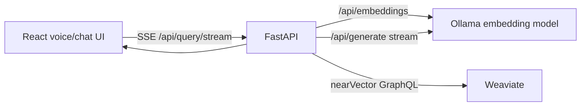

# Semantic Question Answering System (Full Stack)

This repo runs an end-to-end RAG stack:

- **API**: FastAPI (`/query`, `/query/stream`)
- **Vector DB**: Weaviate
- **Model serving**: Ollama (embeddings + generation)

## Full Stack / Resume Highlights (FAANG-style)

**What this is:** a containerized, local-first semantic QA product that ingests **10+ scripture PDFs**, indexes them for vector search, and serves answers via a production-style API (including streaming).

**Architecture (request path):**



**Engineering highlights:**
- **End-to-end system**: PDF → page-wise extraction (PyMuPDF) → chunking (**600 chars + 100 overlap**) → embeddings → Weaviate indexing → retrieval-augmented generation.
- **Backend/API design**: FastAPI service with typed request/response validation (Pydantic), consistent JSON contract, and a health endpoint for dependency checks.
- **Real-time UX**: streaming responses via **Server-Sent Events (SSE)** (`/query/stream`) for chat-like interaction.
- **Storage layer**: Weaviate vector database queried with **`nearVector`** search; chunk metadata stored alongside text for traceable sources.
- **Model serving**: self-hosted Ollama for embeddings + LLM generation (swap models via env vars, no code changes).
- **Quality/evaluation**: built a repeatable evaluation harness to compare embedding models (EmbeddingGemma vs **Qwen3-Embedding-0.6B** vs **nomic-embed-text-v1.5**) using:
  - **DeepEval contextual relevance** (20-question slice from a 50-question set)
  - **Multilingual MRR** (EN/HI/ES query groups)
  - **Cross-scripture title discrimination** (20 questions total; 2 per scripture)
- **DevOps**: Docker Compose for reproducible local deployment of Weaviate + Ollama + API.

**Project framing for Full Stack roles:** built the **user-facing** query experience, the **API layer**, the **data/ETL ingestion pipeline**, and the **containerized infra** needed to run it end-to-end.

**Key results (from the project presentation):**
- **Multilingual MRR**: Qwen3 improved **MRR by ~40% vs EmbeddingGemma** and **~27% vs Nomic**.
- **Title discrimination MRR (20 questions, multi-scripture)**: Qwen **0.654**, Nomic **0.561**, EmbeddingGemma **0.395**.

**Evidence:** see the attached presentation [`Group Id 2_ Semantic Question Answering System.pdf`](Group%20Id%202_%20Semantic%20Question%20Answering%20System.pdf).

## Run with Docker Compose

Bring up the stack:

```bash
docker compose up -d weaviate ollama api web
```

Pull the models (optional helper service):

```bash
docker compose --profile init up -d ollama-init
```

Open the UI:

- Web app: `http://localhost:3000`
- API: `http://localhost:8000` (direct) or `http://localhost:3000/api` (via web proxy)

## Ingest PDFs into Weaviate (one-time)

Your ingestion script is `embbeded.py` (PDF chunking + embeddings + Weaviate writes).

Install ingestion deps locally:

```bash
pip install -r requirements.ingest.txt
```

Run ingestion (expects PDFs under `Files/`):

```bash
WEAVIATE_URL="http://localhost:8081" OLLAMA_URL="http://localhost:11434" python embbeded.py
```

Note: the large PDF corpus is intentionally **not committed** in this repo. Create a local `Files/` directory and place your PDFs there.

## Query the API

Health check:

```bash
curl -s http://localhost:8000/health | jq
```

Non-streaming query:

```bash
curl -s http://localhost:8000/query \
  -H "Content-Type: application/json" \
  -d '{"question":"What does the Gita say about doing your duty without attachment to results?","limit":5}' | jq
```

SSE streaming query:

```bash
curl -N http://localhost:8000/query/stream \
  -H "Content-Type: application/json" \
  -d '{"question":"Summarize Krishna’s guidance on duty.","limit":5}'
```

## Environment variables

- **`WEAVIATE_URL`**: Weaviate base URL (compose uses `http://weaviate:8080`, host uses `http://localhost:8081`)
- **`OLLAMA_URL`**: Ollama base URL (default `http://localhost:11434`)
- **`EMBEDDING_MODEL`**: Ollama embedding model (default `embeddinggemma`)
- **`GENERATE_MODEL`**: Ollama generation model (default `gemma3:4b`)
- **`WEAVIATE_COLLECTION`**: Weaviate class name (default `BhagavadGitaChunks`)

